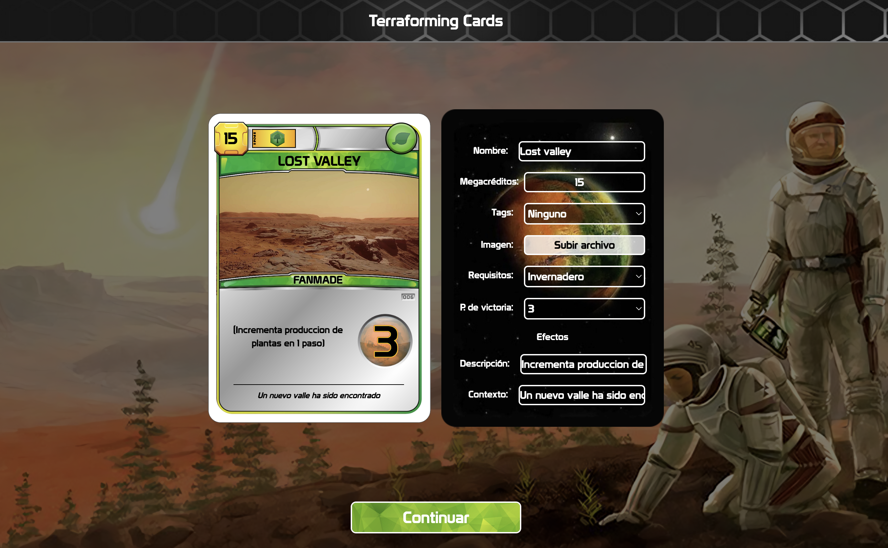
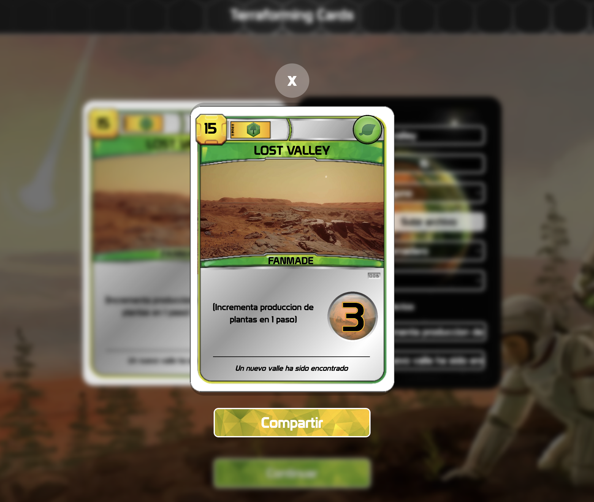

# Terraforming Cards
Terraforming Cards is a fanmade site to create custom cards for Terraforming Cards board game

## Features

### Card Editor & Live Preview


### Share generated card image URL (Stored in Cloudinary)


## Stack

[](https://cloudinary.com)
[](https://reactjs.org)
[](https://www.typescriptlang.org//)
[](https://vitejs.dev)
[](https://tailwindcss.com/)

## Live Sample

[](http://terraformingcards.com)

## Run locally

```bash
git clone git@github.com:sguerra/terraformingcards.git
cd terraformingcards
npm install

# Rename .env.sample file to .env and set Cloudinary variables
# VITE_CLOUDINARY_PRODUCT_ENVIRONMENT with your product env
# VITE_CLOUDINARY_API_KEY with your API key
# VITE_CLOUDINARY_UPLOAD_PRESET with a public upload preset

npm run dev
```

## Contribute

[](https://stackblitz.com/github/sguerra/terraformingcards)
[](https:///pr.new/sguerra/terraformingcards)